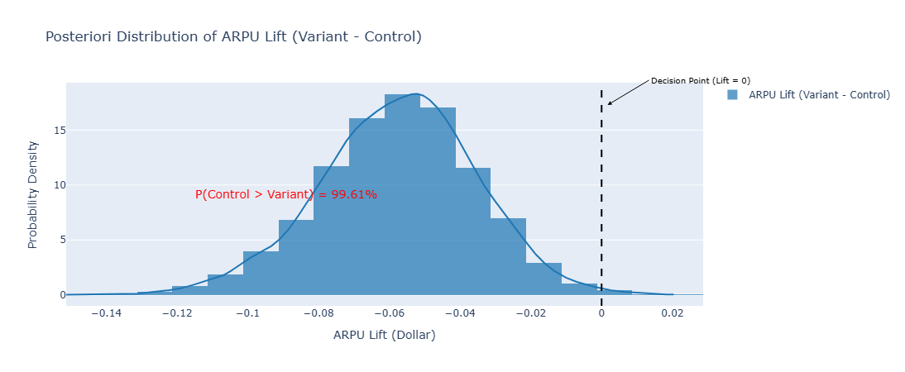
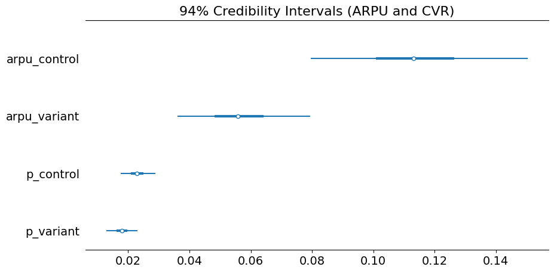

# 📈 E-commerce A/B Test Optimization: Causal Inference with Bayesian Modeling

## Project Overview

This project implements a rigorous framework for A/B testing analysis, moving beyond traditional Frequentist methods (like t-tests) to provide decision-makers with quantified uncertainty. We used a real-world e-commerce dataset to evaluate a product change intended to increase **Average Revenue Per User (ARPU)**.

### Key Focus Areas:
* **Causal Inference:** Validation of randomization and cleaning of data contamination (SUTVA assumption).
* **Advanced Statistics:** Implementation of a **Zero-Inflated Gamma Model** using **PyMC** to correctly handle the highly-skewed revenue distribution and low conversion rates.
* **Architecture & MLOps:** Containerization using **Docker** for guaranteed reproducibility.
* **Business Communication:** Reporting the final result via **Probability of Control being Better (PBB)**, providing a clear, actionable metric for the business.

---
### 🚀 Key Results: Decision at a Glance

* **Final Decision Confidence:** **99.61%** certainty that the **Control** group is superior.
* **Recommendation:** **IMMEDIATE REJECTION** of the Variant.
* **Business Impact Avoided:** Preventing a **-62%** loss in Average Revenue Per User (ARPU).
* **Causal Integrity:** Identified and removed $\mathbf{1,541}$ contaminated users to validate the experiment.

---

## I. 🎯 Executive Summary (Management Report)

| Metric         | Control           | Variant | Raw Lift (Loss) | P(Control > Variant) | Recommendation |
| :------------- | :---------------- | :------ | :-------------- | :------------------- | :------------- |
| **ARPU** | $0.1969 | $0.0749 | -61.96% | 99.61%          | 🛑**REJECT**   |                |

### Final Conclusion: The Variant Must Be Rejected

The Bayesian analysis provides a definitive conclusion with a **99.61% certainty** that the Control version of the product generates more revenue per user than the proposed Variant.

The change introduced in the Variant has been proven to **cause a significant loss in business value**. The Variant must be rejected immediately to prevent revenue destruction.

### Future System Recommendations

Beyond the immediate decision to reject the Variant, a critical architectural process issue was identified during data cleaning: **1,541 users (15.4% of the original sample)** were simultaneously exposed to both the Control and Variant versions.

This **data contamination** compromises the core assumption of Causal Inference (SUTVA). To mitigate future errors, we strongly recommend the Engineering and Analytics teams:

* **Review the User Assignment Logic:** The system responsible for assigning a `USER_ID` to a `VARIANT_NAME` must be audited to ensure that assignment is sticky (persists across sessions) and exclusive upon the first exposure.
* **Implement Server-Side Exclusion:** Introduce a mechanism (e.g., in the Experimentation Platform or database) that prevents a user's ID from being logged for a second, different variant once they have been exposed to the first.

---
### Data Source

This analysis uses the public A/B testing dataset sourced from **Kaggle** [[link to Kaggle dataset](https://www.kaggle.com/datasets/sergylog/ab-test-data)]. The data forms the foundation of our Causal Inference exercise.

---

## II. 🔬 Causal Methodology & Statistical Rigor

### 1. Causal Integrity Check

The first step was a robust check for experiment contamination. We identified **1,541 users** exposed to both the Control and Variant versions (Simultaneous Exposure) and removed them to preserve the **Single Unit Treatment Value Assumption (SUTVA)**.

The final sample showed an almost perfect balance (2390 vs 2393 users), validating the randomization and confirming the causality of the observed effects.

### 2. Bayesian Justification

The data presented two challenges that invalidate simple Frequentist tests:

1. **Low Event Count:** Only 54 and 42 conversions per group.
2. **Extreme Skewness:** The revenue distribution exhibited a highly right-skewed pattern with significant outliers (justifying the need for a robust Gamma distribution).

This justified the use of a **Bayesian Zero-Inflated Model (Beta-Binomial for CVR, Gamma for ARPC)**, which inherently models uncertainty and is robust to non-normal data.

---

## III. 📊 Results and Evidence

The visualization below is the **Posterior Distribution of the ARPU Lift** (Variant - Control).



* The vast majority of the probability density lies to the left of the **Decision Point (Lift = 0)**, quantifying the risk of error at less than $0.39\%$.

The confidence intervals below confirm the separation between the groups:


* The 94% Credibility Intervals for `arpu_control` and `arpu_variant` do **not overlap**, confirming the conclusiveness of the business metric.

---

---

## IV. 💻 Reproducibility & Architecture (Docker Hub Integration)

To ensure the project environment is perfectly reproducible, the project utilizes **Docker**. The `Dockerfile` is located in the `deployment/` directory.

### Docker Image

The pre-built image is available on Docker Hub, making reproduction instantaneous.

* **Image Name:** `viniciuscatelani/ecom-ab-test-bayesian`

### Reproduction Steps (Using Pre-built Image)

1. **Pull the Image:**

   ```bash
   docker pull viniciuscatelani/ecom-ab-test-bayesian
   ```
2. **Run the Container and Access Jupyter:**
   To work with the files on your local machine, you must mount the project directory as a volume.

   * Navigate to the root directory of your cloned project.
   * Run the container, exposing port 8888:

   ```bash
   docker run -p 8888:8888 -v "$(pwd)":/usr/src/app viniciuscatelani/ecom-ab-test-bayesian
   ```

   * Copy the URL provided in the terminal (including the token) to your browser.
3. **Execute the Analysis:**

   * Run the script to generate the trace file (if not already present): `python src/bayesian_model.py`
   * Open `02_Bayesian_Analysis_and_Dashboard.ipynb` to load the `bayesian_trace.nc` file and view the final dashboard.

---
